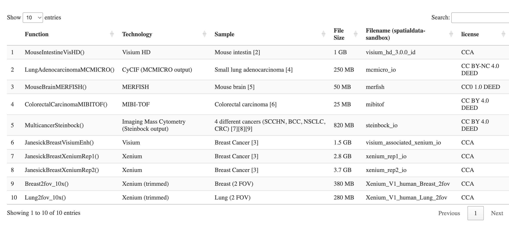

# ZarrBasedSpatialTranscriptomics

Note: the software being described here is in development.  Please
file issues [here](https://github.com/vjcitn/SpatialData) with any concerns.

This R package is devoted to interfacing Zarr-based spatial omics to NHGRI AnVIL.
The code base was spearheaded by the R Interoperability team at a CZI-sponsored,
scverse-hosted hackathon in Basel in November 2024.

If necessary,
install the relevant
packages via `BiocManager::install("vjcitn/SpatialData", ref="datamart")`

As of December 2024 we have the following resources for investigation:



That table can be produced with
```
library(SpatialData.data)
example(demo_spatialdata)
```


